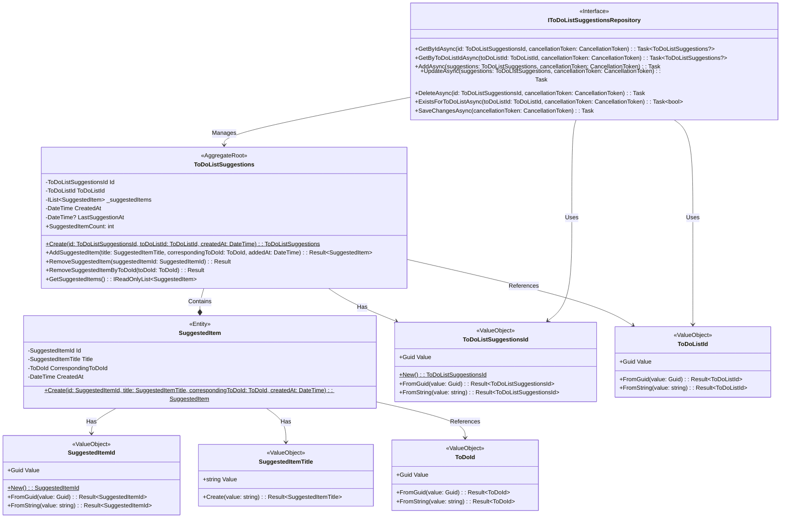

# AiItemSuggestions Domain Model

## Domain Overview

The AiItemSuggestions bounded context manages AI-powered task recommendations and tracks their adoption across todo lists. 
This domain maintains a persistent record of AI suggestions for each todo list, enabling the system to track which items 
were suggested by AI versus created by users. The domain is designed to support future synchronization with the 
ToDoLists domain when needed.

## Domain Model

## Domain Objects

### ToDoListSuggestions (Aggregate Root)

**Short Overview**: The primary aggregate root representing AI suggestion tracking for a specific todo list, 
maintaining a persistent record of all AI suggestions and their corresponding todo items over time.

**Invariants & Domain Logic**:
- Must have valid ToDoListId that cannot be changed once set (immutable ownership)
- One-to-one relationship with ToDoList from ToDoLists domain
- LastSuggestionAt timestamp updated whenever new suggestions are added
- CreatedAt timestamp is immutable and represents when suggestion tracking began for the list
- Controls all modifications to contained SuggestedItem entities through aggregate root methods
- Each SuggestedItem maintains reference to its corresponding ToDoId from the ToDoLists domain

### SuggestedItem (Entity)

**Short Overview**: An individual AI-generated task suggestion that corresponds to an actual todo item in the ToDoLists domain.

**Invariants & Domain Logic**:
- Must have valid, non-empty suggestion title that cannot exceed 200 characters
- Must have valid CorrespondingToDoId that references the actual todo item in the ToDoLists domain
- CorrespondingToDoId must reference valid ToDoId from same ToDoListId (referential integrity)
- CreatedAt timestamp is immutable and represents when the AI suggestion was added to the list
- Modifying methods are internal and can only be called by the ToDoListSuggestions aggregate root
- One-to-one relationship: each SuggestedItem corresponds to exactly one ToDo item

### ToDoListSuggestionsId (Value Object)

**Short Overview**: Strongly-typed identifier for ToDoListSuggestions aggregates ensuring type safety and preventing identifier confusion across domain boundaries.

**Invariants & Domain Logic**:
- Wraps a non-empty Guid value
- Supports implicit conversion to Guid for infrastructure layer compatibility
- Implements proper value object equality semantics

### SuggestedItemId (Value Object)

**Short Overview**: Strongly-typed identifier for SuggestedItem entities ensuring type safety within the suggestions tracking context.

**Invariants & Domain Logic**:
- Wraps a non-empty Guid value
- Supports implicit conversion to Guid for infrastructure layer compatibility
- Implements proper value object equality semantics
- 
### SuggestedItemTitle (Value Object)

**Short Overview**: Validated AI-generated task suggestion title with consistent validation rules matching ToDoLists Title constraints.

**Invariants & Domain Logic**:
- Cannot be null, empty, or consist only of whitespace characters
- Maximum length of 200 characters to align with Title constraints in ToDoLists domain
- Minimum length of 3 characters to ensure meaningful suggestions
- Automatically trims leading and trailing whitespace during creation

### ToDoListId, ToDoId (Value Objects)

**Short Overview**: Imported strongly-typed identifiers from ToDoLists domain ensuring cross-module consistency and referential integrity.

**Invariants & Domain Logic**:
- Reference-only usage within AiItemSuggestions domain
- ToDoListId enables one-to-one relationship with ToDoList aggregates
- ToDoId enables linking suggested items to their corresponding actual todo items

## Repository Interface

### IToDoListSuggestionsRepository

**Short Overview**: Contract for ToDoListSuggestions aggregate persistence and retrieval operations following repository pattern principles.

**Invariants & Domain Logic**:
- GetByIdAsync returns null when aggregate not found, never throws for missing entities
- GetByToDoListIdAsync returns suggestion tracking for specific todo list, null if none exists
- AddAsync persists new aggregates with all contained suggestions atomically
- UpdateAsync persists changes including suggestion additions and removals atomically
- DeleteAsync removes aggregates and all contained entities during ToDoList deletion cascading
- ExistsForToDoListAsync provides efficient existence checking without full aggregate materialization
- All operations support cancellation tokens for proper async operation lifecycle management
- Repository ensures one-to-one relationship constraint between ToDoListId and ToDoListSuggestionsId
- SaveChangesAsync enables unit of work pattern for coordinated persistence operations