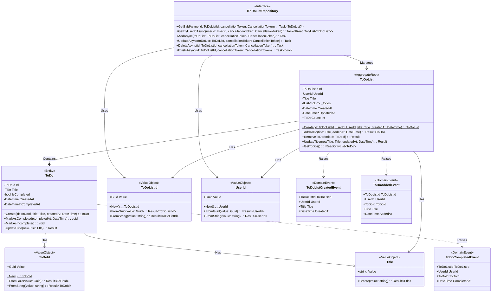

# ToDoLists Domain Model

## Domain Overview

The ToDoLists bounded context manages personal task organization through hierarchical task lists. This domain enables users to create named collections of tasks, with each collection containing between 0-100 individual todo items. The domain enforces business rules around list capacity limits and maintains the integrity of task organization structures.

## Domain Model

## Domain Objects

### ToDoList (Aggregate Root)

**Short Overview**: The primary aggregate root representing a named collection of tasks owned by a specific user with enforced capacity limits and lifecycle management.

**Invariants & Domain Logic**:
- Must have a valid UserId that identifies the owner and cannot be changed once set
- Must have a valid, non-empty title at all times
- Cannot contain more than 100 todo items (MAX_TODOS = 100)
- Cannot contain duplicate todo items (enforced by unique ToDoId)
- Cannot contain two items with equal titles (case-insensitive comparison)
- Tracks creation timestamp and optional update timestamp for audit purposes
- Raises ToDoListCreatedEvent upon creation and ToDoAddedEvent when todos are added
- UpdatedAt timestamp is set whenever the list title changes or todos are modified
- Removal of todos maintains list integrity and updates the UpdatedAt timestamp
- Controls all modifications to contained ToDo entities through aggregate root methods
- User ownership is immutable - lists cannot be transferred between users

### ToDo (Entity)

**Short Overview**: An individual task item within a todo list with completion tracking and title management capabilities.

**Invariants & Domain Logic**:
- Must have a valid, non-empty title at all times
- Maintains completion state (IsCompleted) with optional completion timestamp
- Cannot have CompletedAt timestamp when IsCompleted is false
- Must have CompletedAt timestamp when IsCompleted is true
- Title updates preserve completion state and timestamps
- Raises ToDoCompletedEvent when marked as completed (not when unmarked)
- Modifying methods are internal/private and can only be called by the ToDoList aggregate root

### ToDoListId (Value Object)

**Short Overview**: Strongly-typed identifier for ToDoList aggregates ensuring type safety across domain boundaries.

**Invariants & Domain Logic**:
- Wraps a non-empty Guid value
- Provides factory methods for creation from Guid or string with validation
- Supports implicit conversion to Guid for infrastructure layer compatibility
- Implements proper value object equality semantics

### ToDoId (Value Object)

**Short Overview**: Strongly-typed identifier for ToDo entities ensuring type safety and preventing identifier confusion.

**Invariants & Domain Logic**:
- Wraps a non-empty Guid value
- Provides factory methods for creation from Guid or string with validation
- Supports implicit conversion to Guid for infrastructure layer compatibility
- Implements proper value object equality semantics

### Title (Value Object)

**Short Overview**: Shared value object representing task and list titles with consistent validation rules across the domain.

**Invariants & Domain Logic**:
- Cannot be null, empty, or consist only of whitespace characters
- Maximum length of 200 characters to ensure reasonable display and storage limits
- Automatically trims leading and trailing whitespace during creation
- Immutable once created, ensuring consistency across all usage contexts

### UserId (Value Object)

**Short Overview**: Strongly-typed identifier for user ownership ensuring type safety and preventing user identifier confusion across domain boundaries.

**Invariants & Domain Logic**:
- Wraps a non-empty Guid value representing a user from the Users bounded context
- Provides factory methods for creation from Guid or string with validation
- Supports implicit conversion to Guid for infrastructure layer compatibility
- Implements proper value object equality semantics
- Immutable once created to ensure ownership integrity throughout aggregate lifecycle

## Domain Events

### ToDoListCreatedEvent

Raised when a new ToDoList aggregate is successfully created. Contains the list identifier, owner identifier, initial title, and creation timestamp for downstream processing and audit logging.

### ToDoAddedEvent

Raised when a ToDo item is successfully added to a ToDoList. Includes the owner identifier, parent list and new todo identifiers, plus the todo title and addition timestamp for external system notifications.

### ToDoCompletedEvent

Raised when a ToDo item is marked as completed (not when unmarked). Contains the owner identifier, parent list identifier, todo identifier, and completion timestamp for analytics and notification purposes.

## Repository Interface

### IToDoListRepository

**Short Overview**: Contract for ToDoList aggregate persistence and retrieval operations following repository pattern principles.

**Invariants & Domain Logic**:
- GetByIdAsync returns null when aggregate not found, never throws for missing entities
- GetByUserIdAsync returns all ToDoLists owned by the specified user, empty collection if none found
- AddAsync persists new aggregates and their contained ToDo entities as atomic operations
- UpdateAsync persists changes to existing aggregates including todo modifications atomically
- DeleteAsync removes aggregates and all contained entities, handling cascading operations
- ExistsAsync provides efficient existence checking without full aggregate materialization
- All operations support cancellation tokens for proper async operation lifecycle management
- Repository ensures user ownership constraints are maintained during all persistence operations